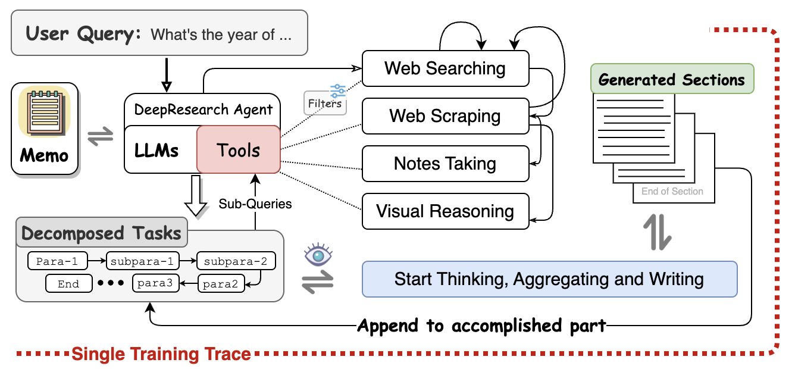
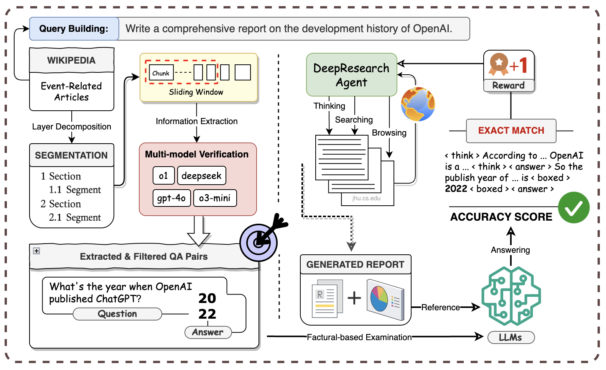

# Critic Search （将来可能重命名为 Deep Research / Deep Report）

## 项目简介
Critic Search 是一个基于大型语言模型（LLM）的自动化报告生成框架，目标是让智能代理自动撰写与人类水平相当、内容详实并带有丰富引用的研究报告或文章。

**核心思路**

- Agent 动态生成查询（search）并浏览（browse）互联网内容  
- 每一句话使用 `<cite>URL</cite>` 精确标注信息来源  
- 引入 Report Bench 对报告质量进行可量化评估，支持后续强化学习训练  

**模块概览**

1. 搜索与抓取工具（Search Aggregator & Content Scraper）  
2. 笔记管理（Taking Notes & Retrieve Notes）  
3. 章节规划与生成（Outline Planning & StartWriting）  
4. 报告评估框架（Report Bench / Factual QA）  
5. 主流程驱动（Action Router & Model Action Decision）  

---

## 系统架构总览



> **图 1** 展示了 Agent 如何将用户查询拆分为子任务，并通过搜索、抓取、笔记、视觉推理等工具循环迭代生成章节。

---

## 核心模块与技术方案

### 1. Search Aggregator
- 位置：`src/criticsearch/tools/search_adapter/search_aggregator.py`  
- 支持 Tavily、Bing 等多引擎并发查询，自动重试与熔断  
- 接口：`search(queries: List[str]) -> SearchResponseList`  

### 2. Content Scraper
- 位置：`src/criticsearch/tools/content_scraper/__init__.py`  
- **两阶段抓取**  
  1. Tavily API 批量提取 `raw_content`  
  2. 失败时回退到 BeautifulSoup 抓取（fallback scrape）  

### 3. Taking Notes & Retrieve Notes
- **taking_notes**：模型触发笔记动作时，用 Jinja2 模板抽取关键信息写入 `agent.memo`  
- **retrieve_notes**：写作前检索笔记补充上下文  

### 4. 章节规划与写作
- **Outline 规划**  
  - 用户未给出 → 使用 `planner_agent_*.txt` 生成 JSON 列表  
  - 用户已给出 → 严格遵循  
- **行动决策**：`_model_action_decision` 输出 `SEARCH | BROWSE | START_WRITING`  
- **行动路由**：`_action_router` 递归执行，直至写作  
- **写作**：`guided_generation_thought.txt` → `<StartWriting>...</StartWriting>`  

### 5. Report Bench / Factual QA
- 数据：`reportbench/wiki_data` 中的 Wikipedia JSON  
- **滑动窗口抽取**：唯一答案用 `<box>` 包裹  
- **评估流程**  
  1. `ReportVerifier.verify_section(content, facts)`  
  2. 准确率记录到 `agent.training_data`  
- 准确率作为 RL reward 信号  



> **图 2** 展示 Wikipedia → 滑动窗口抽取 → 多模型验证 → QA 过滤 → 准确率回馈的流程。

---

## 整体工作流程

```mermaid
flowchart TD
    subgraph 用户
        Q[Query / Instruction]
    end
    subgraph Agent
        A1(是否需要生成大纲？)
        A2[生成 / 读取 Outline]
        loop(章节循环)
        S1[搜索 SearchAggregator]
        S2[抓取 ContentScraper]
        N1[记笔记 TakeNotes]
        N2[检索笔记 RetrieveNotes]
        W[<StartWriting>...]
        RB[Report Bench 评测]
    end
    subgraph 系统
        C1[拼接全部章节]
        C2[抽取 <cite> 链接]
    end
    Q --> A1 --> A2 --> loop
    loop --> S1 --> S2 --> N1
    N1 --> N2 --> W --> RB
    RB --下一章节--> loop
    loop -->|完成| C1 --> C2

⸻

强化学习回路

(state = {outline, notes, partial_report, ...})
       │
[action = {search, scrape, note, retrieve, write}]
       │
[next_state] ──► Report Bench 打分 ──► reward r_t
       ▲
       └──────── policy / value model ◄────────┘

	•	每个章节结束即计算 r_t
	•	默认支持 PPO / REINFORCE，可替换其他算法

⸻

使用示例

# 安装依赖
poetry install
# or
pip install -r requirements.txt

# 配置 API Key
cp settings.yaml.template settings.yaml
# 编辑 settings.yaml，填入 Tavily、Bing、OpenAI 等密钥

# 运行单任务模式
criticsearch "写一份 2024 年叙利亚反对派进攻战役概述"

# 并发批量模式（从映射文件）
criticsearch --from-mapping \
  --mapping-file reportbench/instruction_mapping.json \
  --concurrent -w 5 --limit 10


⸻

目录结构

/criticsearch
├── base_agent.py        # Agent 核心逻辑
├── main.py              # 主流程入口
├── tasks_runner.py      # CLI 调度及历史保存
├── session.py           # RAGEN 接口封装
├── tools
│   ├── search_adapter   # 搜索引擎集成
│   └── content_scraper  # 网页内容抓取
├── prompts              # Jinja2 模板
└── reportbench          # 评估框架
    ├── wiki_data        # Ground Truth 数据
    ├── report_benchmark.py
    └── verifier.py


⸻

开发 & 扩展
	•	新增搜索引擎：继承 BaseSearchClient，实现 search 方法并注册到 SearchAggregator
	•	扩展爬取策略：修改 fallback_scrape 或添加新的 Scraper 类
	•	强化学习集成：利用 agent.training_data 与 accuracy 自定义 reward

⸻

致谢

开源工具：Httpx、BeautifulSoup4、Tenacity、Rich、Jinja2
欢迎贡献与讨论！

> **验证方式**：将上述文本保存为 `README.md`，在 GitHub 或 VS Code Markdown Preview 中预览，排版与图片应保持与示例截图一致。如仍有错位，请确认：  
> 1) 图片路径是否为 `images/...`；  
> 2) 渲染器是否启用自定义样式（部分主题会放大一级标题字体）。